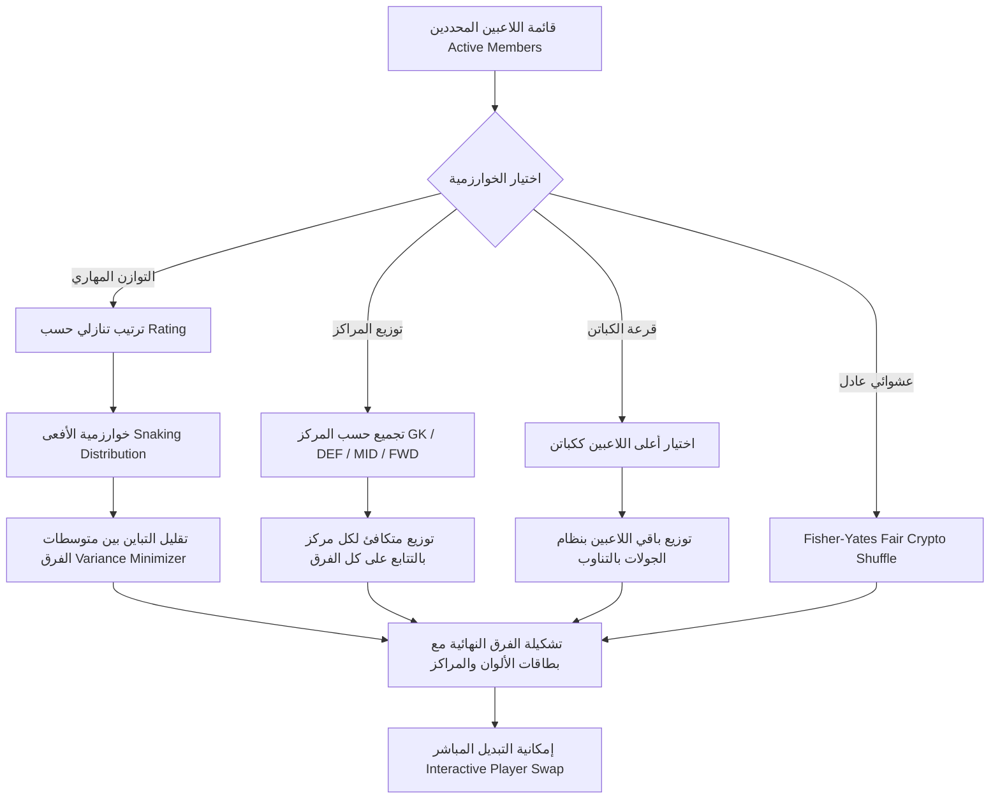

# ⚡ TEAM ME PRO (تيمي برو) 🏆
### *Smart Team Matchmaking, Multi-Touch Finger Chooser & Tournament Bracket Engine*
> **منصة تفاعلية ذكية لإدارة وتوزيع الفرق الرياضية وفرق الألعاب، وإدارة البطولات الإقصائية، وقرعة لمس الأصابع المتعددة، ومحرك اتخاذ القرارات العشوائية بتصميم زجاجي استثنائي (Glassmorphism).**

---

<div align="center">

[](https://expo.dev)
[](https://reactnative.dev)
[](https://react.dev)
[](https://expo.dev)
[](https://github.com/Amr-khalid/TeammeApp)
[](LICENSE)

[🌟 المميزات الرئيسية](#-المميزات-الرئيسية--key-features) •
[📱 الشاشات والوظائف](#-الشاشات-والوظائف--screens--modules) •
[🎨 نظام المظاهر](#-نظام-المظاهر-الزجاجية--9-glassmorphism-themes) •
[🧠 خوارزميات التوزيع](#-خوارزميات-توليد-الفرق-الذكية--matchmaking-algorithms) •
[🚀 التشغيل والتثبيت](#-دليل-التثبيت-والتشغيل--quick-start) •
[🏗️ المعمارية التقنية](#-البنية-والمعمارية-التقنية--architecture)

</div>

---

## 🌟 نظرة عامة | Overview

**TEAM ME PRO (تيمي برو)** هو تطبيق الهاتف المحمول والويب التقدمي المتكامل المصمم لإنهاء الخلافات وحسم توزيع الفرق في المباريات والفعاليات والألعاب الجماعية. يجمع التطبيق بين **خوارزميات رياضية ذكية للتكافؤ والتوازن**، وتجربة لمس أصابع تفاعلية متعددة الأصابع **(Multi-Touch Roulette)**، ومولد بطولات إقصائية **(Knockout Brackets)** متكامل، مع تصميم مستقبلي يعتمد على الزجاج الشفاف **(Glassmorphism)** ومؤثرات صوتية واهتزازية حية (Haptics & Audio FX) مع دعم ثنائي اللغة (العربية مع خفة دم مصرية، والإنجليزية).

---

## 🌟 المميزات الرئيسية | Key Features

### ⚡ 1. محرك توليد الفرق المتكافئة الذكي (Smart Team Generator)
- **4 خوارزميات توزيع رياضية متقدمة**:
  - `توزيع المهارة المتوازن (Balanced Skill)`: خوارزمية الأفعى (Snaking) وتقليل التباين لضمان تقارب مجموع نقاط وقوة الفرق.
  - `التوزيع حسب المراكز (Role & Position Aware)`: توزيع عادل لحراس المرمى، المدافعين، وصناع اللعب والمهاجمين بين كل الفرق.
  - `قرعة الكباتن (Captains Draft)`: اختيار رؤساء الفرق بالقرعة وتوزيع باقي اللاعبين بنظام الأدوار بالتتابع.
  - `العشوائية الكاملة (Pure Random / Fair Shuffle)`: خلط عشوائي معتمد على خوارزمية *Fisher-Yates* المشفرة.
- **تبديل اللاعبين التفاعلي (Interactive Live Player Swap)**: إمكانية نقل أو مبادلة أي لاعب بين فريق وآخر بنقرة زر مع إعادة احتساب متوسطات القوة وتحديث واجهة التشكيلة فوراً.
- **مشاركة وتصدير فوري (Export & Share)**: تصدير التشكيلة نصياً بنقرة واحدة إلى WhatsApp، Telegram، أو الحافظة مع بطاقات ملونة مميزة.

### 🖐️ 2. قرعة لمس الأصابع التفاعلية (Multi-Touch Finger Chooser)
- استشعار لمس متعدد فائق الدقة حتى **10 أصابع متزامنة** على الشاشة.
- دوائر ضوئية نيون نابضة وتأثيرات جسيمات (Particles & Glowing Waves) لكل لمسة مع تحديد لون فريد لكل إصبع.
- **3 أنماط لعب مبتكرة**:
  1. `القرعة الفردية (Single Winner)`: اختيار شخص عشوائي للبدء، دفع الحساب، أو ضربة البداية.
  2. `تقسيم الفرق المباشر باللمس (Touch Team Split)`: تقسيم الأصابع الملموسة إلى فريقين أو أكثر بألوان متطابقة تلقائياً.
  3. `توفيق الثنائيات (Pair Matchmaker)`: تجميع كل إصبعين متجاورين في ثنائي مشترك.
- عداد تنازلي حماسي مع نبضات اهتزازية (Haptic Ticks) ومؤثرات صوتية متصاعدة.

### 🏆 3. نظام إدارة البطولات والإقصائيات (Knockout Tournament Generator)
- إنشاء جداول مباريات إقصائية تلقائية (دور الـ 16، ربع النهائي، نصف النهائي، والنهائي ومباراة المركز الثالث).
- تسجيل النتائج المباشرة للمباريات وتأهيل الفائزين للجولة التالية تلقائياً.
- شاشة تتويج استعراضية للبطل الفائز مع إطلاق قصاصات الاحتفال (Confetti Fireworks) ومؤثرات الفوز الصوتية.

### 🔮 4. العراف ومحرك اتخاذ القرارات (Oracle & Decision Maker)
- أداة حسم القرارات السريعة والخلافات بروح فكاهية ولهجة مصرية أصيلة.
- **عجلة الحظ التفاعلية (Spinning Wheel)**: إضافة خيارات لا نهائية وتدوير العجلة بمؤثرات صوتية فيزيائية.
- **رمي العملة (3D Coin Flip)**: وجه أو ظهر مع دوران واقعي.
- **ردود العراف الذكي**: إجابات ذكية وفكاهية عشوائية لحسم المواقف الصعبة.

### 👥 5. إدارة قائمة الأعضاء واللاعبين (Roster & Members Management)
- حفظ اللاعبين مع تقييم مستوى المهارة (من 1 إلى 5 نجوم).
- تحديد مركز اللاعب والصفة: (مهاجم ⚽، مدافع 🛡️، حارس مرمى 🧤، خط وسط 🎯، كابتن 👑، جوكر 🃏، نجم ⭐، جيمر 🎮).
- **استيراد جماعي ذكي (Bulk Import)**: لصق قائمة أسماء دفعة واحدة من الواتساب أو الملاحظات وسيتم استخراجهم وضبطهم تلقائياً.
- فلترة متقدمة، بحث فوري، وتفعيل/تعطيل حضور اللاعبين بنقرة واحدة (Active/Bench).

### 🎨 6. تسعة مظاهر زجاجية أسطورية (9 Glassmorphism Themes)
- دعم كامل للـ Glassmorphism والتأثيرات الزجاجية الشفافة والـ Gradients الفخمة.
- تبديل فوري للمظهر مع حفظ التفضيل محلياً.

### 🔊 7. تجربة صوتية واهتزازية غامرة (Immersive Audio & Haptics)
- محرك صوتي مدمج عبر `expo-audio` بمؤثرات (نقرات، شحن طاقة، صافرة، احتفال، سحب، وحذف).
- ردود فعل لمسية واهتزازية هابتك دقيقة عبر `expo-haptics` تزيد من متعة التفاعل.

### 🌐 8. دعم كامل للغتين والعامية المصرية (Bilingual + Egyptian Dialect)
- تبديل فوري بين **العربية (RTL)** و **الإنجليزية (LTR)**.
- نصوص ومصطلحات كروية وشبابية ممتعة، مع خيار التبديل للهجة المصرية الخفيفة في العراف والنتائج.

### 💾 9. خصوصية كاملة وعمل أوفلاين (100% Offline-First)
- لا يتطلب أي تسجيل دخول أو اتصال بالإنترنت أو خوادم خارجية.
- حفظ جميع البيانات محلياً على جهاز المستخدم عبر `AsyncStorage`.
- إمكانية أخذ نسخة احتياطية من البيانات بصيغة JSON واستعادتها في أي وقت.

---

## 📱 الشاشات والوظائف | Screens & Modules

| الشاشة | المسار / الكود | الوظيفة الأساسية |
| :--- | :--- | :--- |
| 🏠 **الرئيسية (Home)** | `src/screens/HomeScreen.js` | لوحة التحكم، الإحصائيات السريعة، أزرار الوصول السريع للأدوات، ومبدل المظاهر واللغة |
| 👥 **الأعضاء (Members)** | `src/screens/MembersScreen.js` | إدارة وتعديل قائمة اللاعبين، تقييم النجوم، اختيار المراكز، والاستيراد الجماعي السريع |
| ⚡ **توليد الفرق (Generate)** | `src/screens/GenerateScreen.js` | إعداد الفرق، اختيار الخوارزمية، التوليد المتكافئ، التبديل التفاعلي للاعبين، والمشاركة |
| 🖐️ **قرعة الأصابع (Finger Chooser)** | `src/screens/FingerChooserScreen.js` | شاشة لمس تفاعلية متعددة النقاط لاختيار الفائز أو تقسيم الفرق عبر لمس الشاشة |
| 🏆 **البطولات (Tournament)** | `src/screens/TournamentScreen.js` | توليد وإدارة شجرة المباريات الإقصائية، رصد الأهداف، وتتويج البطل بالكونفيتي |
| 🔮 **العراف (Oracle)** | `src/screens/OracleScreen.js` | عجلة الحظ، رمي العملة، واختيار القرارات العشوائية بنكهة كوميدية ذكية |
| 📜 **السجل (History)** | `src/screens/HistoryScreen.js` | أرشيف التشكيلات والبطولات السابقة مع إمكانية استعادتها أو مشاركتها مجدداً |
| ⚙️ **الإعدادات (Settings)** | `src/screens/SettingsScreen.js` | اختيار المظاهر الـ 9، التحكم في الأصوات والاهتزازات، اللغة، والنسخ الاحتياطي |

---

## 🎨 نظام المظاهر الزجاجية | 9 Glassmorphism Themes

```
┌─────────────────┬──────────────────────┬───────────────────────┬────────────────────────┐
│ المظهر (ID)     │ الاسم العربي          │ الإنجليزية            │ الألوان الأساسية       │
├─────────────────┼──────────────────────┼───────────────────────┼────────────────────────┤
│ manga_black     │ أسود × أبيض نوار     │ Shadow Noir           │ #000000 | #38bdf8      │
│ manga_white     │ أبيض × أسود مانجا    │ Manga Paper           │ #ffffff | #0284c7      │
│ nebula          │ نيبولا كوني          │ Nebula (Default)      │ #070817 | #7c3aed      │
│ frost           │ جليدي نقي            │ Pure Frost            │ #f1f5f9 | #0284c7      │
│ corporate       │ أوبسيديان كربوني     │ Obsidian Slate        │ #0b0f19 | #94a3b8      │
│ royal           │ ذهبي ملكي            │ Imperial Gold         │ #0c0a09 | #f59e0b      │
│ aurora          │ زمردي أورورا         │ Aurora Emerald        │ #041c16 | #10b981      │
│ cyber           │ سايبر نيون HUD       │ Cyber Voltage         │ #050811 | #00f0ff      │
│ crimson         │ قرمزي ياقوتي         │ Velvet Crimson        │ #180812 | #ec4899      │
└─────────────────┴──────────────────────┴───────────────────────┴────────────────────────┘
```

---

## 🧠 خوارزميات توليد الفرق الذكية | Matchmaking Algorithms



---

## 🏗️ البنية والمعمارية التقنية | Architecture

```
appTeemme/
├── assets/                    # الأيقونات وصور الشعار والخلفيات وشاشات البدء
├── src/
│   ├── components/            # مكونات الواجهة المعيارية القابلة لإعادة الاستخدام
│   │   ├── common/            # كروت الزجاج، الأزرار المتوهجة، شرائح المهارة، البار العلوي
│   │   ├── finger/            # دوائر اللمس وتأثيرات الجسيمات لقرعة الأصابع
│   │   ├── generate/          # كروت الفرق، منتقي الخوارزمية، ومحاور التبديل
│   │   ├── layout/            # الهيكل العام، شريط التبويب، والخلفيات المتدرجة
│   │   ├── members/           # بطاقات اللاعبين، نافذة الإضافة، ومحرر التقييم
│   │   ├── navigation/        # شريط التنقل السفلي المخصص بتصميم زجاجي
│   │   ├── oracle/            # عجلة الحظ، رمي العملة، وكرات القرارات
│   │   └── tournament/        # شجرة تصفيات البطولات، كروت المواجهات، وبوديوم التتويج
│   ├── context/               # إدارة الحالة العامة (State Management)
│   │   ├── AppDataContext.js  # سياق إدارة اللاعبين والفرق وسجل المباريات
│   │   ├── LanguageContext.js # سياق الترجمة الفورية العربية والإنجليزية
│   │   └── ThemeContext.js    # سياق الثيمات والمظهر والتطبيق الفوري
│   ├── navigation/            # إعدادات React Navigation 7
│   │   └── AppNavigator.js    # التنقل بين التبويبات والشاشات الفرعية
│   ├── screens/               # شاشات التطبيق الرئيسية الثمانية
│   ├── services/              # المحركات والخدمات البرمجية
│   │   ├── audioService.js    # محرك المؤثرات الصوتية والموسيقى
│   │   ├── generatorEngine.js # خوارزميات التوزيع والذكاء الرياضي
│   │   └── hapticsService.js  # محرك النبضات الاهتزازية المتزامنة
│   └── theme/                 # ثوابت الألوان والمظاهر الـ 9 ونظام الـ Tokens
├── App.js                     # نقطة الانطلاق الرئيسية للتطبيق
├── app.json                   # إعدادات Expo وتهيئة منصات Android / iOS / Web
├── eas.json                   # إعدادات البناء السحابي لـ EAS Build
└── package.json               # حزم ومكتبات المشروع
```

---

## 🚀 دليل التثبيت والتشغيل | Quick Start

### المتطلبات الأساسية (Prerequisites):
- تثبيت **Node.js** (الإصدار 18 أو أحدث).
- تثبيت **npm** أو **yarn**.
- تطبيق **Expo Go** على هاتفك (Android / iOS) للتجربة الحية.

### خطوات التثبيت:

1. **استنساخ المستودع (Clone Repository)**:
```bash
git clone https://github.com/Amr-khalid/TeammeApp.git
cd TeammeApp
```

2. **تثبيت الحزم والاعتماديات (Install Dependencies)**:
```bash
npm install
```

3. **تشغيل المشروع محلياً (Start Dev Server)**:
```bash
npx expo start
```

### خيارات التشغيل المباشر:
- اضغط `a` لفتح التطبيق على محاكي **Android Emulator**.
- اضغط `i` لفتح التطبيق على محاكي **iOS Simulator**.
- اضغط `w` لفتح التطبيق على **المتصفح (Web Browser)**.
- امسح رمز الـ **QR Code** الظاهر في الطرفية عبر تطبيق **Expo Go** لتجربته مباشرة على هاتفك!

---

## 📦 أوامر البناء والتصدير | Build & Export

### بناء حزمة أندرويد (Android APK / AAB):
```bash
# بناء ملف APK مباشر للتجربة
npx eas build -p android --profile preview

# بناء ملف AAB لمتجر Google Play
npx eas build -p android --profile production
```

### بناء حزمة آيفون (iOS IPA):
```bash
npx eas build -p ios --profile production
```

### تصدير نسخة الويب (Web Static Build):
```bash
npx expo export --platform web
```

---

## 🛠️ التقنيات المستخدمة | Tech Stack

- **Framework**: [React Native](https://reactnative.dev/) (v0.86.2) via [Expo SDK 57](https://expo.dev/)
- **Core Library**: [React 19](https://react.dev/) (v19.2.3)
- **Navigation**: [React Navigation 7](https://reactnavigation.org/) (Bottom Tabs + Native Stack)
- **Animations**: [React Native Reanimated](https://docs.swmansion.com/react-native-reanimated/) & [Gesture Handler](https://docs.swmansion.com/react-native-gesture-handler/)
- **Styling**: Vanilla React Native StyleSheet + Custom Glassmorphism Design Token Engine
- **Audio Engine**: [Expo Audio](https://docs.expo.dev/versions/latest/sdk/audio/)
- **Haptic Engine**: [Expo Haptics](https://docs.expo.dev/versions/latest/sdk/haptics/)
- **Icons**: [Lucide React Native](https://lucide.dev/) & [@expo/vector-icons](https://icons.expo.fyi/)
- **Storage**: [@react-native-async-storage/async-storage](https://react-native-async-storage.github.io/async-storage/)
- **Graphics**: [React Native SVG](https://github.com/software-mansion/react-native-svg) & [Expo Linear Gradient](https://docs.expo.dev/versions/latest/sdk/linear-gradient/)

---

## 🤝 المساهمة والتطوير | Contributing

نرحب بمساهماتكم لتطوير التطبيق! للمساهمة:
1. قم بعمل **Fork** للمستودع.
2. أنشئ فرعاً لميزتك الجديدة (`git checkout -b feat/amazing-feature`).
3. احفظ التغييرات بكوميت احترافي (`git commit -m 'feat: add amazing feature'`).
4. ارفع التغييرات إلى فرعك (`git push origin feat/amazing-feature`).
5. افتح طلب سحب **(Pull Request)** للمراجعة.

---

## 📄 الترخيص | License

هذا المشروع مرخص بموجب رخصة **MIT License** — راجع ملف [LICENSE](LICENSE) لمزيد من التفاصيل.

---

<div align="center">

**صُنِع بكل ❤️ وشغف بواسطة [عمرو خالد | Amr Khalid](https://github.com/Amr-khalid)**

*TEAM ME PRO — صانع المباريات والبطولات الذكي للأبطال* ⭐

</div>
